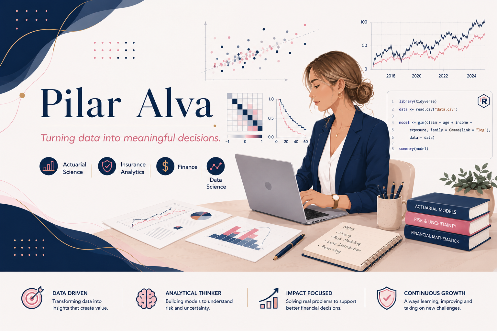

  

# 👋 Hi, I'm Pilar Alva

### *Turning data into meaningful decisions.*

**Actuarial Science Student** • **Data Science** • **Statistics** • **Finance**

I'm an actuarial science student passionate about applying statistics, programming and machine learning to solve real-world problems.

My GitHub showcases projects focused on actuarial science, insurance analytics, financial modeling and predictive analytics.

---

## 👩 About Me

I'm an Actuarial Science student passionate about transforming data into meaningful decisions through statistics, programming and analytical thinking.

My interests focus on:

- 📊 Data Science
- 📈 Statistical Modeling
- 🛡️ Insurance Analytics
- 💼 Financial Analysis
- 🤖 Machine Learning

I'm currently building projects that combine actuarial science, predictive analytics and real-world datasets to strengthen my technical and business skills.

---

## 🛠 Technical Skills

### Programming

- R
- Python

### Data Analysis

- Excel
- Statistics

### Machine Learning

- Scikit-learn (Learning)

### Version Control

- Git
- GitHub

---

## 📂 Featured Projects

🚧 Coming soon...

Projects currently under development:

- Socioeconomic Segmentation using ENIGH 2024
- Time Series Forecasting
- Insurance Analytics
- Machine Learning for Risk Analysis
---

## 🎓 Education

**Bachelor's Degree in Actuarial Science**

Universidad Autónoma del Estado de México (UAEMéx)

Expected Graduation: 2027

---

## 🌱 Currently Learning

- Advanced R Programming
- Machine Learning
- Git & GitHub
- Data Visualization
---

## 📫 Contact

- LinkedIn *(Coming Soon)*
- Portfolio *(Coming Soon)*

Thanks for visiting my profile!
